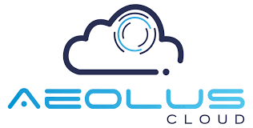

# Desafio Aeolus — Backend de Eventos (Kafka, MinIO, ClickHouse, MongoDB)

<div style="text-align: center;"></div>


---

## 📌 Descrição do Projeto
Este repositório implementa um serviço backend em **Node.js** para ingestão e processamento de eventos de câmeras. Em alto nível, o sistema:

- Recebe mensagens via **Kafka** (metadados + imagem em base64);
- Armazena imagens em **MinIO** (compatível com S3) e grava metadados analíticos no **ClickHouse**;
- Valida e enriquece eventos com o cadastro de câmeras em **MongoDB** (acessado via Prisma);
- Expõe uma **API RESTful** com CRUD de câmeras, consultas/pesquisas de eventos, filtros, paginação e geração de URLs assinadas para imagens.

O propósito é demonstrar integração entre sistemas distribuídos, boas práticas de design de APIs, uso de containers (Docker Compose) e uma suíte de testes automatizados (integração + E2E). Para entender o raciocínio por trás das decisões e os aprendizados, consulte o DevLog em `Documentacao/DevLog`.

---

## 🏗️ Arquitetura (alto nível)

1. Producer publica no tópico `device-events` (Kafka)
2. Consumer (Node + kafkajs) processa a mensagem
    - Valida câmera (MongoDB via Prisma)
    - Converte imagem base64 → Buffer e envia ao MinIO (S3)
    - Insere um registro no ClickHouse (tabela `events`)
3. API Express expõe endpoints para listar/buscar eventos e gerar URL assinada da imagem

Serviços orquestrados por Docker Compose: MongoDB (ReplicaSet), Kafka + Zookeeper, MinIO, ClickHouse.

---

## 🧰 Stack Técnica

- Node.js 20, Express 5
- kafkajs (Kafka), @aws-sdk/client-s3 (MinIO), axios (ClickHouse)
- Prisma Client (MongoDB)
- Jest + Supertest (testes)

---

## 🗂️ Estrutura do Projeto

```text
desafio-Aeolus/
├─ src/
│  ├─ routes/
│  │  ├─ cameras.js            # Rotas CRUD de câmeras (Mongo via Prisma)
│  │  └─ events.js             # Rotas de eventos (ClickHouse/MinIO)
│  ├─ services/
│  │  ├─ createBucket.js       # Cria bucket no MinIO no boot
│  │  └─ kafkaConsumer.js      # Consumer Kafka → MinIO → ClickHouse
│  └─ app.js                   # App Express exportável (para testes)
├─ prisma/
│  └─ schema.prisma            # Modelo Camera (MongoDB)
├─ config-services-docker/
│  ├─ mongo-init.js            # Inicia ReplicaSet do Mongo
│  └─ init-events-table-clickhouse.sq # Cria tabela events
├─ __tests__/                  # Testes automatizados (Jest/Supertest)
│  ├─ integration/
│  │  ├─ cameras.routes.test.js
│  │  └─ events.routes.test.js
│  └─ e2e/
│     └─ pipeline.e2e.test.js  # Fluxo completo (Kafka→MinIO→ClickHouse)
├─ index.js                    # Bootstrap do servidor (usa app.js)
├─ docker-compose.yml          # Infraestrutura: Mongo, Kafka, ZK, MinIO, ClickHouse
├─ .env / .env.example         # Variáveis de ambiente
├─ package.json                # Scripts, dependências e testes
└─ Documentacao/DevLog         # Diário de desenvolvimento (aprendizados e decisões)
```

---

## ⚙️ Variáveis de Ambiente (.env)

Exemplo mínimo para rodar localmente (fora de containers):

```bash
PORT=3000

# MongoDB (ReplicaSet do compose)
DATABASE_URL="mongodb://localhost:27017/aeolus?replicaSet=rs0"

# Kafka (exposto no host)
KAFKA_BROKER=localhost:9092

# MinIO (porta de API S3 mapeada no host)
MINIO_ENDPOINT=http://localhost:9002
MINIO_ROOT_USER=minio
MINIO_ROOT_PASSWORD=minio123
MINIO_BUCKET=images

# ClickHouse (HTTP API)
CLICKHOUSE_URL=http://localhost:8123
```

Observação: o compose mapeia MinIO como 9002→9000 e a console web em 9001.

---

## 🐳 Subindo a infraestrutura (Docker Compose)

1. Certifique-se de que o Docker Desktop está rodando.
2. Na pasta `desafio-Aeolus/` execute:

```powershell
docker compose up -d
```

Serviços e portas:

- MongoDB: 27017
- Zookeeper: 2181
- Kafka: 9092 (PLAINTEXT)
- ClickHouse HTTP: 8123 (Console SQL opcional via HTTP)
- MinIO API (S3): 9002 → 9000 (interno)
- MinIO Console Web: 9001

Verifique: a tabela no ClickHouse e o ReplicaSet do Mongo são inicializados pelos scripts em `config-services-docker/`.

---

## ▶️ Rodando a aplicação (host)

Instale as dependências e inicie:

```powershell
npm install
npm run start
```

O script `start` (concurrently) executa:

- `minio`: cria/garante o bucket no MinIO
- `index`: sobe o servidor Express
- `kafka`: inicia o consumer (Kafka → MinIO → ClickHouse)

API disponível em: <http://localhost:3000>

---

## 🐋 Rodando a aplicação em container (Dockerfile)

> Por enquanto eu descartei porque eu teria que ter mais tempo para corrigir o problema de conexão quando app esta em container.

---

## 🔌 Endpoints principais

Base: `http://localhost:3000`

### Câmeras (`/cameras`)

- POST `/cameras` — cria uma câmera
- GET `/cameras` — lista câmeras
- GET `/cameras/:id` — busca por id
- PUT `/cameras/:id` — atualiza campos
- DELETE `/cameras/:id` — apaga

> ⚠️ Nota: o sistema simulador ou qualquer producer só terá seus eventos registrados se a câmera estiver previamente cadastrada via `POST /cameras`. Cadastre a câmera antes de enviar eventos.

Modelo (Mongo/Prisma):

```ts
type Camera = {
  id: string; // ObjectId
  name: string;
  cameraID: string; // unique
  zona: string;
  enderecoRTSP?: string;
  createdAt: Date;
  updatedAt: Date;
}
```

### Eventos (`/eventos`)

- GET `/eventos` — lista eventos (ClickHouse)
- GET `/eventos/filter?from=&to=&cameraID=&limit=&offset=` — filtros por data/câmera + paginação
- GET `/eventos/camera/:cameraID` — eventos de uma câmera
- GET `/eventos/camera/:cameraID/latest?limit=` — últimos N eventos de uma câmera
- GET `/eventos/:id` — evento por eventId
- GET `/eventos/:id/image-url` — URL assinada (S3/MinIO) para baixar a imagem

Observação: em rotas de listagem, os eventos podem vir enriquecidos com `cameraInfo` (dados do Mongo), facilitando o frontend.

---

## 📨 Esquema do evento (Kafka → Consumer)

Exemplo de payload:

```json
{
  "deviceId": "CAM-001",
  "eventId": "2025-10-14T10:23:45.123Z",
  "timestamp": "2025-10-14T10:23:45.123Z",
  "image": { "base64": "..." },
  "confidence": 0.82
}
```

Processamento:

- Validação de câmera no Mongo (`cameraID`/`deviceId`)
- Upload da imagem para `MINIO_BUCKET` com chave: `cameraID/timestamp.jpg`
- Insert no ClickHouse (tabela `events`) com `JSONEachRow`

> ⚠️ Importante: quando você enviar um POST pelo sistema simulador (ou qualquer producer), o evento só será processado e registrado se a câmera já estiver cadastrada no backend via endpoint `POST /cameras` (ou já existir no banco). Eventos de câmeras não cadastradas serão ignorados pelo consumer.

---

## 🧪 Testes automatizados

- Integração (Supertest): `/cameras` e `/eventos`
- E2E (Kafka→MinIO→ClickHouse): publica uma mensagem no Kafka, aguarda processamento, verifica objeto no MinIO e registro no ClickHouse

Comandos:

```powershell
npm test          # roda a suíte completa (usa ESM: experimental-vm-modules)
npm run test:watch
npm run test:e2e  # requer docker-compose UP e a API rodando
```

Dica: o E2E depende do tempo de processamento do consumer. A suíte já aguarda alguns segundos, mas, se necessário, aumente esse tempo.

> ⚠️ Importante: É nescessario abrir outro terminal para executar estes scripts enquanto o backend e a infra estão rodando de fundo.

---

## 🪵 DevLog (Documentação viva)

Consulte `Documentacao/DevLog` — registrei o passo a passo do desenvolvimento, decisões, erros encontrados e soluções. É uma ótima forma de entender o “porquê” das escolhas e o aprendizado durante o desafio, que forão muitos, tenho uma lista com uns 30 assuntos diferentes para estudar depois anotados no meu Obsidian agora! (kkkkkk).

---

## 🛠️ Troubleshooting

- Docker pull falhando com “blob not found”:
  - Limpe cache e camadas corrompidas
  - Reinicie o Docker Desktop e rode `docker compose pull && docker compose up -d`
- Kafka não conecta do app: verifique `KAFKA_BROKER=localhost:9092` no `.env` quando a app roda no host
- MinIO: API é `http://localhost:9002` (S3) e console em `http://localhost:9001`
- ClickHouse: cheque SQL via HTTP: `http://localhost:8123/?query=SHOW%20TABLES`

---

Feito com carinho, aprendi muito mais do que esperava desenvolvendo este projeto. Qualquer dúvida, abre uma issue! 💬
